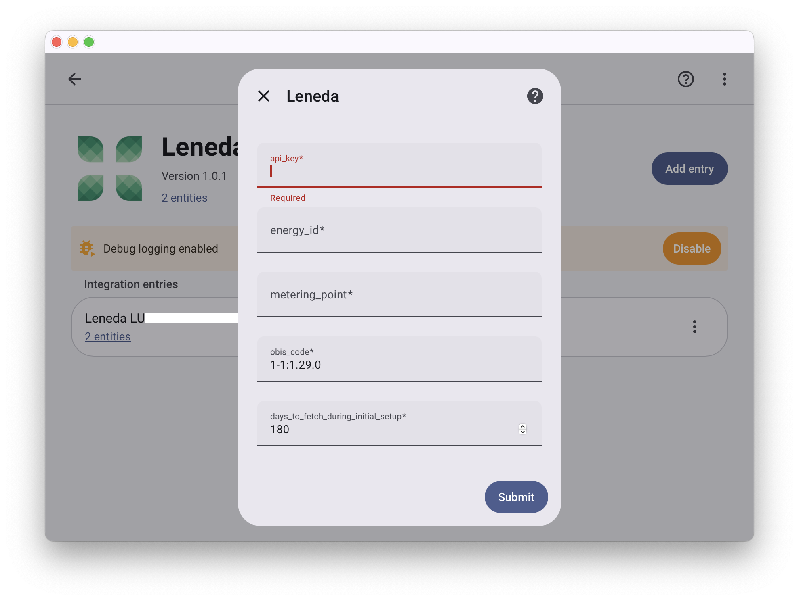

---
```
Disclaimer: This is an unofficial custom integration. This project is not affiliated with, endorsed by, or associated with Leneda, Creos, Enovos, or Home Assistant. All product names, logos, and brands are property of their respective owners.
```
---
#   Leneda
A small 
 
Home Assistant integration that imports electric power and energy statistics from the 
 
[Leneda API](https://www.leneda.lu/en/docs/api-reference) and exposes them as sensors with recorder statistics.
  
## Installation
**HACS (Home Assistant Community Store)**
1. **Download via HACS**   
   [](https://my.home-assistant.io/redirect/hacs_repository/?owner=magiczoom2&repository=HA-Leneda-power&category=integration)
2. **Restart Home Assistant!**
3. **Configure Integration**   
   [](https://my.home-assistant.io/redirect/config_flow_start/?domain=leneda)

When adding the integration you will be prompted for the following values:
- **Required** Get from your [Leneda profile](https://app.leneda.eu/my-profile)
  - `metering_point` — your Leneda metering point identifier.
  - `energy_id` — your Leneda energy identifier.
  - `api_key` — Leneda API key. [How to get an API key?](https://www.leneda.lu/en/docs/how-to-generate-and-manage-api-keys)
- **Optional**
  - `days_to_fetch_during_initial_setup` — number of past days of historical data to download during initial setup (integer, default: `180` days). 
  - `obis_code` — [OBIS code](https://www.leneda.lu/en/docs/obis-code-meaning) to read (default: `1-1:1.29.0`).


## Features
### Sensors
- `Power Demand` sensor — electric power measurements (kW) aggregated to hourly statistics with value, min, max and mean.
- `Energy Consumption` sensor — electric energy measurements (kWh) aggregated to hourly statistics with cumulative sum and value.

### Energy Dashboard
The power and energy sensors can be connected to the [Energy Dashboard](https://www.home-assistant.io/dashboards/energy/)


### Statistics Graph Card
The power and energy sensors data can be visualized using [Statistics Graph Card](https://www.home-assistant.io/dashboards/statistics-graph/)


## Other Installation Methods

### HACS Installation - Custom Repository
1. Open **HACS** → **⋮** → **Custom repositories** (See [HACS Custom Repositories](https://hacs.xyz/docs/faq/custom_repositories/))
2. Add repository URL `https://github.com/magiczoom2/HA-Leneda-power` and set category to **Integration**, then click **Add**.
3. In HACS search for **Leneda**, click **Download**.
4. Restart Home Assistant.
5. Go to **Settings** → **Devices & Services** → **+ Add Integration** and search for **Leneda**.

### Manual Installation

1. Download the latest release from the [Releases](https://github.com/magiczoom2/HA-Leneda-power/releases) page.
2. Copy the `custom_components/leneda` folder to your Home Assistant `config/custom_components/` directory.
3. Restart Home Assistant.
4. Go to **Settings** → **Devices & Services** → **+ Add Integration** and search for **Leneda**.
